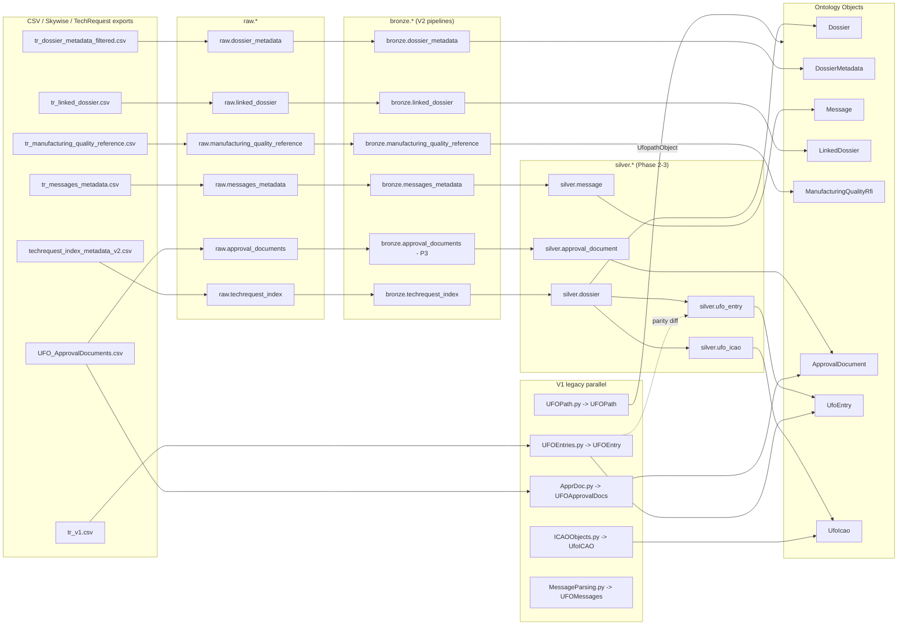
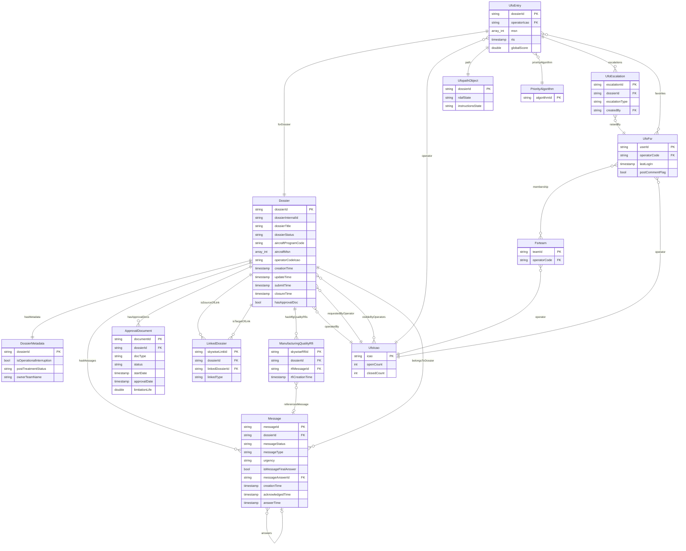
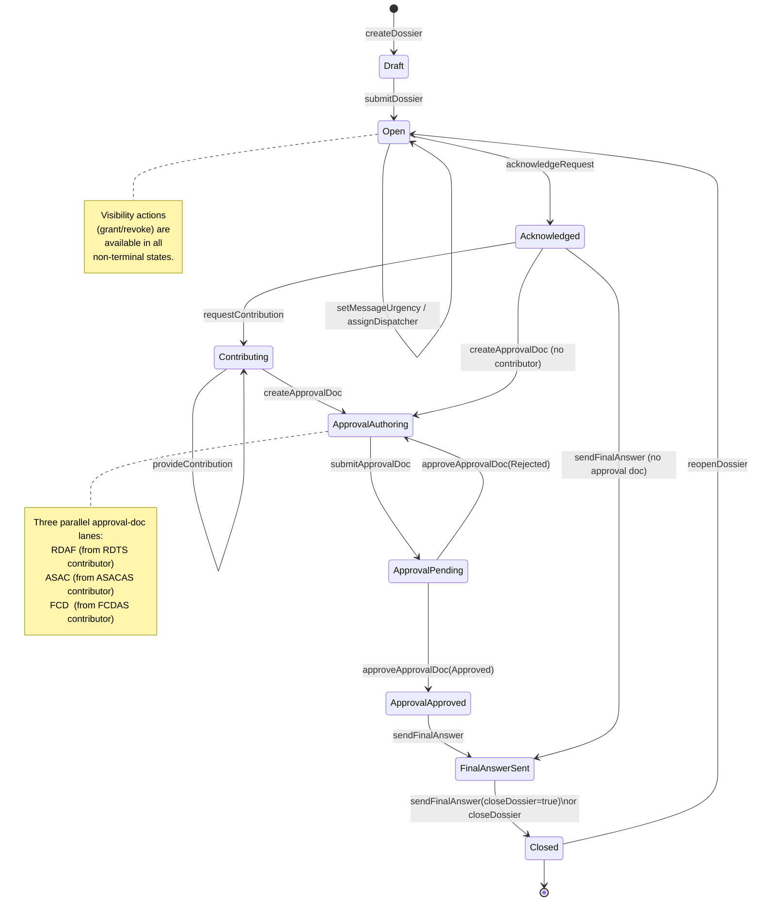
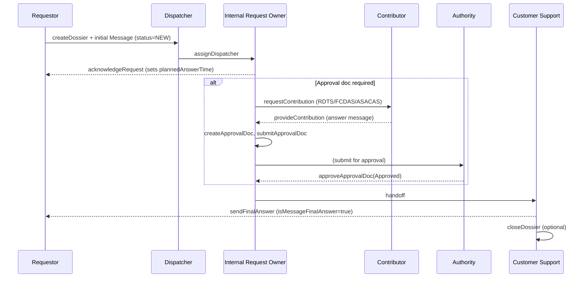

# UFO V2 — Ontology Technical Specification

| Field | Value |
| --- | --- |
| Document | UFO V2 Ontology Spec — Objects, Links, Actions, Functions |
| Version | 0.1 (draft) |
| Owner | JT (`jstaylor926@gmail.com`) |
| Audience | Implementation team (Foundry transforms, Ontology, Workshop) |
| Status | Draft for review |
| Last updated | 2026-05-13 |
| Repo | `C:\Users\jstay\UFO\ufo_project_ontology` |
| Reference | [Palantir Foundry — Ontology overview](https://www.palantir.com/docs/foundry/ontology/overview/) |

---

## 1. Executive summary

The UFO program manages **unscheduled aircraft Tech Requests** (dossiers) end-to-end: creation by a requestor, dispatch and acknowledgement, contribution by engineering teams, approval‑document authoring (RDAF / ASAC / FCD), and final answer delivery. V1 of the UFO Ontology in Foundry materializes a small number of objects (`Ufoentry`, `UfoIcao`, `UfoFsr`, `Fsrteam`, `UfoEscalation`, `UfopathObject`, `PriorityAlgorithm`) primarily from a hand-shaped “dossier index” feed and supports a north-American FSR dashboard.

**V2** rebases the Ontology onto a **typed, timezone-aware, Bronze‑gated** data layer (`raw → bronze → silver → ontology`) and broadens the object model to first-class **Dossier**, **Message**, **ApprovalDocument**, **LinkedDossier**, **ManufacturingQualityRfi** types — while preserving full functional parity for V1 Workshop modules through a **`v2_compat` shim** and a **parity diff harness**. V2 also introduces a typed comments module (`CommentsV2`) that replaces V1's delimited-string encodings with structured `CommentEntry` records and pure view functions.

This document specifies, at implementation depth: every V2 Object Type, every Link Type with cardinality and join key, every Action Type and its parameters, every Function-backed property, the underlying datasource lineage, and the V1→V2 column/key mappings. Items net-new in V2 are tagged **`[NEW]`**; items carried over from V1 (with no schema change beyond renames) are tagged **`[V1]`**; items reshaped from V1 are tagged **`[RESHAPED]`**.

---

## 2. Scope and conventions

### 2.1 In scope

- Object Types, Link Types, Properties, and Actions that comprise the V2 Ontology.
- Function-backed properties and edit functions (TypeScript) bound to those object types.
- Backing dataset lineage from CSV ingest through Bronze to Ontology binding.
- V1 → V2 migration mappings (column renames, key translation, parity comparisons).

### 2.2 Out of scope

- Workshop module layouts (referenced only where they consume an action or function-backed property).
- Foundry permissions / Marking model (deferred to Phase 4 security review).
- Quiver/Object Explorer configurations.
- Streaming/CDC ingest (V2 is batch).

### 2.3 Naming conventions

| Layer | Convention | Example |
| --- | --- | --- |
| Raw CSV | source-native (mixed) | `id_dossier`, `messageCreationDate` |
| Bronze (V2) | `snake_case`, UTC, typed | `dossier_id`, `creation_time`, `creation_time_tz` |
| Object Type | `PascalCase`, singular | `Dossier`, `UfoEntry` |
| Object property | `camelCase` | `dossierTitle`, `creationTime` |
| Link Type | `verbPhrase` from the source object | `Dossier.hasMessages`, `Dossier.linkedTo` |
| Action Type | `verbPhraseObject` | `addCommentToUfoEntry`, `acknowledgeRequest` |
| Function | `camelCase`, side-effect-free unless `@OntologyEditFunction` | `commentBreakdown`, `addComment` |

> **Foundry rule:** UTC is the only timestamp tz stored on bronze; the original offset is preserved in the paired `*_tz` column. Workshop renders in viewer locale.

### 2.4 Foundry construct quick reference

| Construct | Definition (Foundry) | Used here for |
| --- | --- | --- |
| **Object Type** | Schema + backing datasource for a real-world entity | Dossier, Message, UfoEntry, … |
| **Property** | Typed field on an object type | `dossierTitle: String`, `aircraftMsn: Array<Integer>` |
| **Link Type** | Typed, cardinality-bound relationship between two object types | `Dossier.hasMessages → Message[]` |
| **Action Type** | Governed write that creates/edits/deletes objects and emits side effects | `addComment`, `escalate`, `sendFinalAnswer` |
| **Function** | Pure or edit-capable business logic in TS/Python; bindable as function-backed property or function-backed action | `CommentsV2.commentsByCode(...)` |
| **Function-backed property** | Computed property whose value is the return of a Function | `Ufoentry.commentsTechnicalMd` |
| **Datasource** | The Foundry dataset (or virtual table) that backs an object type | `bronze.techrequest_index` → `Dossier` |
| **Interface** | Abstract shape implemented by multiple object types (polymorphism) | `Commentable`, `LifecycleManaged` (Phase 4) |

---

## 3. Domain model (business view)

The UFO Ontology models the lifecycle of a **Tech Request (Dossier)** raised by an airline operator, internal Airbus team, or supplier. A dossier carries one or more **Messages** (the conversation), zero-or-more **ApprovalDocuments** (RDAF / ASAC / FCD / RDAS-TA), zero-or-more **DefectReports**, and a **PostTreatment** outcome status. Dossiers may be **linked** to other dossiers (Move / Copy of context). Each dossier targets an **Aircraft** (program / type / model / MSN(s)) registered to an **Operator** (identified by ICAO code) and may scope a specific **Component** (part number / serial / FIN).

The North-America FSR dashboard layer (`UfoEntry`, `UfoIcao`, `UfoFsr`, `Fsrteam`, `UfoEscalation`, `UfopathObject`) is a workflow projection over the same dossier population — managing prioritization (`PriorityAlgorithm`), escalations, comment triage, and Return-To-Service (RTS) tracking by MSN. V2 keeps that projection but rebases it on the bronze spine.

**Primary actors**

| Actor | Role |
| --- | --- |
| Requestor (external / internal) | Creates dossier, asks the question, receives final answer |
| Dispatcher | Routes the request, assigns owning team |
| Internal Request Owner | Acknowledges, sets planned answer date, manages dossier |
| Contributor (CoE Supplier, Design Office, SBC, AS) | Provides RDTS / FCDAS / ASACAS / DR data |
| Customer Support / AIRTAC | Finalizes approval docs, sends final answer, controls visibility |
| Authority | Approves/Rejects RDAF / ASAC / FCD |
| FSR (Field Service Rep, N-America) | Operates the UFO Dashboard; prioritizes, escalates, comments |

---

## 4. Object Type Catalog

Each Object Type below has: **status tag**, **purpose**, **backing dataset**, **primary key**, **title key**, **status indicator** (where applicable), and a full **Property table**. Property `Type` follows Foundry's primitive set (`String`, `Boolean`, `Integer`, `Long`, `Double`, `Timestamp`, `Date`, `Array<T>`, `Struct`, `Attachment`).

### 4.1 `Dossier` **[NEW in V2]**

**Purpose.** Canonical Tech Request entity — the spine of V2. One row per dossier with the full set of identity, aircraft, party, ATA, and lifecycle properties. Replaces the implicit "dossier index" feed that V1 carried as columns on `Ufoentry`.

**Backing dataset.** `bronze.techrequest_index` (V2 bronze pipeline `bronze_techrequest_index.py`, 102 fields). Will be promoted to `silver.dossier` in Phase 2 once enrichment is added (currently bronze is wired direct).

**Primary key.** `dossierId` (`dossier_id` in bronze; numeric, but **not stable** across V1↔V2 for migrated dossiers — `dossierInternalId` is the stable join key for parity).
**Title.** `dossierTitle`. **Status indicator.** `dossierStatus` (`OPEN` / `CLSD-u` / `CLOSED`).

| Property (camelCase) | Bronze column | Type | Notes / typing rule |
| --- | --- | --- | --- |
| dossierId | dossier_id | String | PK |
| dossierInternalId | dossier_internal_id | String | Stable join key (parity) |
| dossierDomain | dossier_domain | String | |
| dossierTitle | dossier_title | String | Title property |
| dossierLabel | dossier_label | String | RTS scraped from this in V1 |
| dossierChannel | dossier_channel | String | |
| isDossierMigrated | is_dossier_migrated | Boolean | |
| dossierStatus | dossier_status | String | Status indicator |
| aircraftProgramCode | aircraft_program_code | String | e.g. `LRRS` |
| aircraftProgram | aircraft_program | String | |
| manufacturerAircraftId | manufacturer_aircraft_id | Array&lt;String&gt; | |
| skywiseAircraftId | skywise_aircraft_id | Array&lt;String&gt; | |
| isApplicableForAllMsn | is_applicable_for_all_msn | Boolean | |
| aircraftMsn | aircraft_msn | Array&lt;Integer&gt; | Set-equality compared in parity |
| aircraftType | aircraft_type | String | |
| aircraftModel | aircraft_model | String | |
| registrationNumber | registration_number | String | |
| aircraftFlightHours | aircraft_flight_hours | Double | |
| aircraftFlightCycles | aircraft_flight_cycles | Integer | |
| operatorCodeIcao | operator_code_icao | String | FK → `UfoIcao.icao`. V1 aliases USA→AAL (see §10.4) |
| engineSeries | engine_series | String | |
| engineModel | engine_model | String | |
| componentSerialNumber | component_serial_number | String | |
| componentPartNumber | component_part_number | String | |
| componentFlightCycles | component_flight_cycles | Integer | |
| componentFlightHours | component_flight_hours | Double | |
| componentFin | component_FIN | String | |
| ataChapter | ata_chapter | Integer | |
| ata | ata | String | 4-digit `ata` |
| requestorCompanyCodeIcao | requestor_company_code_icao | String | |
| visibleByCompanyCodeIcao | visible_by_company_code_icao | Array&lt;String&gt; | Visibility list |
| creationTime | creation_time / creation_time_tz | Timestamp | UTC; tz preserved alongside |
| updateTime | update_time / update_time_tz | Timestamp | |
| submitTime | submit_time / submit_time_tz | Timestamp | |
| closureTime | closure_time / closure_time_tz | Timestamp | |
| numberTotalMessages | number_total_messages | Integer | |
| numberClosedMessages | number_closed_messages | Integer | |
| messageSoonestRequestedAnswerTime | message_soonest_requested_answer_time / *_tz | Timestamp | |
| highestMessageUrgency | highest_message_urgency | String | |
| isMessageOpen | is_message_open | Boolean | |
| hasApprovalDoc | has_approval_doc | Boolean | |
| approvalDocType | approval_doc_type | Array&lt;String&gt; | `RDAF` / `ASAC` / `FCD` / `RDAS-TA` |
| _ingestedAt | _ingested_at | Timestamp | DQ |
| _sourceDataset | _source_dataset | String | DQ |
| _rowUid | _row_uid | String | SHA2 row hash |

### 4.2 `DossierMetadata` **[NEW in V2]** — wide context companion

**Purpose.** Wide-table companion to `Dossier` carrying the interruption, post-treatment, chargeability, and ownership context for analytics and Workshop side-panels. One-to-one with `Dossier` on `dossierId`.

**Backing dataset.** `bronze.dossier_metadata` (V2 bronze pipeline `bronze_dossier_metadata.py`, 149 fields).
**Primary key.** `dossierId`. **Title.** `dossierTitle`. **Status indicator.** `dossierStatus`.

Notable property groups (full schema in **Appendix A.1**):

- **Chargeability** — `isDossierChargeable`, `dossierChargeableReason`, `ammReference`, `ipcReference`, `tsmReference`.
- **Operational/Technical interruption** — `isOperationalInterruption`, `isTechnicalInterruption`, `eventTime`, `interruptionDuration`, `interruptionType`, `interruptionSymptomCode`, `isInterruptionEtopsEdto`, `departureAirportIata`, `arrivalAirportIata`, `interruptionMainBase`, `interruptionMaintenanceAction`, `isInterruptionValidated`, `interruptionAtaChapter`, `interruptionAtaSection`, `interruptionSentTime`, `isInterruptionSentToEcollection`.
- **Ownership / routing** — `ownerTeamName`, `ownerRoutingTeamName`.
- **Requestor company** — `requestorType`, `requestorCompanyId`, `isRequestorFromAirbus`, `requestorCompanyName`, `requestorCompanyCodeIcao`, `requestorCompanyCodeCki`, `requestorCompanyCageCode`, `requestorCompanyCategory`, `requestorCompanyArpListId`, `requestorCompanyCountry`, `isDossierVisibleByExternal`.
- **Lifecycle (extended)** — `dossierCreationTime`, `dossierUpdateTime`, `dossierSubmitTime`, `dossierClosureTime`, `dossierReopenTime` (5 TS pairs).
- **Post-treatment** — `postTreatmentStatus`, `postTreatmentReason`, `isPostTreatmentRequired`, `isPostTreatmentAnalysisCompleted`, `isPostTreatmentSari` (+ `postTreatmentSariReference`, `postTreatmentSariLink`), `postTreatmentGenericOccurrence`, `isPostTreatmentTdo` (+ `postTreatmentTdoReference`), `isPostTreatmentManufacturingQuality` (+ `hasPostTreatmentManufacturingQualityReference`, `isPostTreatmentManufacturingQualityNotificationSent`), `hasPostTreatmentEnvironmentImpact` (+ `postTreatmentEnvironmentImpact`), `isPostTreatmentIsi` (+ `postTreatmentIsiReference`), `hasPostTreatmentDocContent` (+ `postTreatmentDocContentReference`, `isPostTreatmentDocContentCreated`).

> **Design choice.** Phase 3 will evaluate folding this into `Dossier` as a Foundry **Struct** column (`postTreatment: PostTreatmentStruct`, `interruption: InterruptionStruct`) once the shared-struct pattern is approved. For now they remain a sibling object for clean schema migration.

### 4.3 `Message` **[NEW in V2]**

**Purpose.** A single message inside a dossier conversation (request, contribution answer, final answer, RFI, …).

**Backing dataset.** `bronze.messages_metadata` (V2 bronze pipeline `bronze_messages_metadata.py`, 107 fields).
**Primary key.** `messageId`. **Title.** `messageTitle`. **Status indicator.** `messageStatus`.

| Property | Bronze column | Type | Notes |
| --- | --- | --- | --- |
| messageId | message_id | String | PK |
| messageInternalId | message_internal_id | String | |
| dossierId | dossier_id | String | FK → `Dossier` |
| dossierInternalId | dossier_internal_id | String | |
| dossierDomain | dossier_domain | String | |
| messageTitle | message_title | String | Title |
| messageStatus | message_status | String | Status |
| messageType | message_type | String | |
| messageSubType | message_sub_type | String | |
| fromPartnerType | from_partner_type | String | |
| fromCompanyName | from_company_name | String | |
| fromCompanyId | from_company_id | String | |
| toPartnerType | to_partner_type | String | |
| toCompanyName | to_company_name | String | |
| toCompanyId | to_company_id | String | |
| isFromDossierOwner | is_from_dossier_owner | Boolean | |
| isToDossierOwner | is_to_dossier_owner | Boolean | |
| isFromAirbus | is_from_airbus | Boolean | |
| messageVisibility | message_visibility | String | |
| visibleByCompanyName | visible_by_company_name | Array&lt;String&gt; | |
| visibleByCompanyId | visible_by_company_id | Array&lt;String&gt; | |
| firstRequestedAnswerTime | first_requested_answer_time / *_tz | Timestamp | |
| requestedAnswerTime | requested_answer_time / *_tz | Timestamp | |
| urgency | urgency | String | `LOW` / `MEDIUM` / `HIGH` / `URGENT` |
| messageLabel | message_label | String | |
| isMessageAcknowledged | is_message_acknowledged | Boolean | |
| acknowledgedTime | acknowledged_time / *_tz | Timestamp | |
| isMessageNew | is_message_new | Boolean | |
| isMessageFinalAnswer | is_message_final_answer | Boolean | Drives `sendFinalAnswer` |
| messageAnswerId | message_answer_id | String | FK → `Message` (answer link) |
| messageAnswerInternalId | message_answer_internal_id | String | |
| creationTime | creation_time / *_tz | Timestamp | |
| lastUpdateTime | last_update_time / *_tz | Timestamp | |
| statusChangeTime | status_change_time / *_tz | Timestamp | |
| commitTime | commit_time / *_tz | Timestamp | |
| submitTime | submit_time / *_tz | Timestamp | |
| answerTime | answer_time / *_tz | Timestamp | |
| firstPlannedAnswerTime | first_planned_answer_time / *_tz | Timestamp | |
| plannedAnswerTime | planned_answer_time / *_tz | Timestamp | |
| externalReference | external_reference | String | |
| quotationNumber | quotation_number | String | |
| quotationArea | quotation_area | String | |
| quotationVersion | quotation_version | String | |
| skywiseSolutionDeliverableId | skywise_solution_deliverable_id | String | |
| _ingestedAt, _sourceDataset, _rowUid | (DQ) | | |

### 4.4 `LinkedDossier` **[NEW in V2]** — link object

**Purpose.** Foundry link object materializing the M:N **Dossier ↔ Dossier** "Move" / "Copy" relation. Modelled as an object (not a pure link) because it carries a `linkedType` property and may carry an audit trail in Phase 3.

**Backing dataset.** `bronze.linked_dossier` (V2 bronze pipeline `bronze_linked_dossier.py`, 11 fields).
**Primary key.** `skywiseLinkId`.

| Property | Bronze column | Type | Notes |
| --- | --- | --- | --- |
| skywiseLinkId | skywise_link_id | String | PK, NOT NULL |
| dossierId | dossier_id | String | FK → `Dossier` (source) |
| dossierInternalId | dossier_internal_id | String | |
| dossierDomain | dossier_domain | String | |
| linkedDossierId | linked_dossier_id | String | FK → `Dossier` (target) |
| linkedDossierInternalId | linked_dossier_internal_id | String | |
| linkedDossierDomain | linked_dossier_domain | String | |
| linkedType | linked_type | String | enum: `Move` / `Copy` |
| _ingestedAt, _sourceDataset, _rowUid | (DQ) | | |

### 4.5 `ManufacturingQualityRfi` **[NEW in V2]**

**Purpose.** A manufacturing-quality Request-For-Information message that references a dossier. Backs the post-treatment "manufacturing quality" workflow.

**Backing dataset.** `bronze.manufacturing_quality_reference` (V2 bronze pipeline `bronze_manufacturing_quality_reference.py`, 9 fields).
**Primary key.** `skywiseRfiId`.

| Property | Bronze column | Type | Notes |
| --- | --- | --- | --- |
| skywiseRfiId | skywise_rfi_id | String | PK |
| dossierId | dossier_id | String | FK → `Dossier` |
| dossierInternalId | dossier_internal_id | String | |
| rfiMessageId | rfi_message_id | String | FK → `Message` (when present) |
| rfiCreationTime | rfi_creation_time / *_tz | Timestamp | |
| _ingestedAt, _sourceDataset, _rowUid | (DQ) | | |

### 4.6 `ApprovalDocument` **[RESHAPED — V1 `UFOApprovalDocs` → V2 `ApprovalDocument`]**

**Purpose.** RDAF / ASAC / FCD / RDAS-TA approval document attached to a dossier, with limitation-life metrics.

**Backing dataset.**
- V1 (current): `UFO_ApprovalDocuments` (output of `ApprDoc.py`).
- V2 target: `silver.approval_document` derived from `bronze.approval_documents` (Phase 3 — schema mirrors V1 with `*_tz` pairs and snake_case names; V1 fields routed through `v2_compat.normalize_v2_approval`, see §10.3).

**Primary key.** `documentId` (V1: `DocumentID`). **Status indicator.** `status` (V1: `Status`).

| Property (V2) | V1 column | Type | Notes |
| --- | --- | --- | --- |
| documentId | DocumentID | String | PK |
| dossierId | Dossier_ID | String | FK → `Dossier` |
| status | Status | String | |
| docType | DocType | String | RDAF / ASAC / FCD / RDAS-TA |
| docCategory | DocCategory | String | |
| limitationType | LimitationType | String | enum (`flight_hours`, `flight_cycles`, `date`, mixed) |
| issue | Issue | String | |
| rdafType | rdafType | String | |
| startDate | startDate / startDate_tz | Timestamp | |
| targetDate | target_date / target_date_tz | Timestamp | Phase 3 |
| endTargetDate | end_target_date / end_target_date_tz | Timestamp | Phase 3 |
| approvalDate | approval_date / approval_date_tz | Timestamp | Phase 3 |
| assignedDate | assigned_date / assigned_date_tz | Timestamp | Phase 3 |
| universalKey | UniversalKey | String | composite (`Dossier_ID + DocumentID`) |
| limitationLife | LimitationLife | Double | % of allotted FH / FC / date life remaining |
| limitationFlightHours | (parsed) | Double | derived in V2 silver |
| limitationFlightCycles | (parsed) | Integer | derived in V2 silver |
| limitationMonths | (parsed) | Integer | derived in V2 silver |

### 4.7 `UfoEntry` **[V1 — retained, repointed]**

**Purpose.** North-America FSR dashboard entity per dossier. In V2 it is reframed as an **analytic projection** over `Dossier` for the FSR workflow (priority, escalations, comments, RTS).

**Backing dataset.** V1: `UFOEntry` (from `UFOEntries.py`). V2: `silver.ufo_entry` (Phase 2) — V2 will rebuild this from `silver.dossier` joined with the V1-derived enrichments (RTS scrape, ALTEN/ESG/ITD program flags, escalation flags). Parity harness (`v2_parity/parity_ufo_entry.py`) validates V1↔V2 row equivalence on a deterministic 1/256 hash bucket.

**Primary key.** `dossierId` (V1: `Dossier_ID`). **Title.** `title`. **Status.** `status`.

Selected property table (29 parity-tracked fields — full V1 schema in `UFOEntries.py`):

| Property (V2) | V1 column | Type | Comparator (parity) | Notes |
| --- | --- | --- | --- | --- |
| dossierId | Dossier_ID | String | `compare_string` | PK |
| dossierInternalId | Internal_Id | String | (join key) | Stable |
| title | Title | String | `compare_string` | |
| status | Status | String | `compare_string` | |
| operatorIcao | operator_ICAO | String | `compare_string` + USA→AAL alias | FK → `UfoIcao` |
| msn | MSN | Array&lt;Integer&gt; | `compare_int_array_as_set` | |
| aircraftType | Aircraft_Type | String | `compare_string` | |
| aircraftStatus | AircraftStatus | String | `compare_string` | |
| rts | RTS | Timestamp | `compare_timestamp` | Return-to-Service |
| msnRts | MSN_RTS | Timestamp | `compare_timestamp` | RTS by MSN (joined) |
| globalScore | GlobalScore | Double | `compare_double` | Computed by `PriorityAlgorithm` |
| comments | Comments | String (delim) | n/a | V1 raw delim. V2 reads via `CommentsV2` |
| commentsTechnical | (computed) | String (md) | n/a | Function-backed (`CommentsV2.commentsByCode("Technical")`) |
| commentsParts | (computed) | String (md) | n/a | Function-backed |
| commentsCustomerSupport | (computed) | String (md) | n/a | Function-backed |
| linkedComments | linkedComments | String (delim) | n/a | V1 raw delim, V2 typed |
| lastPartsComment | lastPartsComment | Timestamp | (n/a) | Stamped by `addComment` |
| lastTechComment | lastTechComment | Timestamp | (n/a) | Stamped by `addComment` |
| lastCustComment | lastCustComment | Timestamp | (n/a) | Stamped by `addComment` |
| rdafDelivered | RDAF_Delivered | String | `compare_string` | enum |
| repairInstrProvided | RepairInstrProvided | String | `compare_string` | enum |
| escalatedInternal | Internal_Escalation | Boolean | `compare_bool` | |
| escalatedCustomer | Customer_Escalation | Boolean | `compare_bool` | |
| escalatedParts | Parts_Escalation | Boolean | `compare_bool` | |
| dossierCreationDate | Dossier_CreationDate | Timestamp | `compare_timestamp` | |
| dossierUpdateDate | Dossier_UpDate | Timestamp | `compare_timestamp` | |
| dossierClosureDate | Dossier_ClosureDate | Timestamp | `compare_timestamp` | |
| ata | ata | String | `compare_string` | |
| numberTotalMessages | number_total_messages | Integer | `compare_int` | |
| hasApprovalDoc | has_approval_doc | Boolean | `compare_bool` | |
| approvalDocType | approval_doc_type | Array&lt;String&gt; | `compare_string` (joined) | |

> See `_parity_utils.FIELD_MAP` for the canonical comparator wiring and **Appendix B** for the full parity matrix.

### 4.8 `UfoIcao` **[V1 — retained]**

**Purpose.** One object per Operator ICAO code. Holds dashboard capacity counters (Open/Closed/Amber/Red) for the FSR Operator scorecards.

**Backing dataset.** V1: `UfoICAO` (from `ICAOObjects.py`). V2: `silver.ufo_icao` (Phase 2; rebuild on `Dossier.operatorCodeIcao` aggregation).
**Primary key.** `icao`. **Status indicator.** none.

| Property | V1 column | Type |
| --- | --- | --- |
| icao | ICAO | String (PK) |
| openCount | OPENCount | Integer |
| closedCount | ClosedCount | Integer |
| ambersAlloted | AmbersAlloted | Integer |
| amberCount | AmberCount | Integer |
| redCount | RedCount | Integer |
| redCapMet | RedCapMet | Boolean |
| amberCapMet | AmberCapMet | Boolean |

### 4.9 `UfoFsr` **[V1 — retained]**

**Purpose.** Field Service Representative (FSR) — the human operator of the dashboard. Holds favorites/scenario state, login activity, and the comment-flag toggle.

**Backing dataset.** V1: FSR registry (out of scope for bronze; managed through Workshop edits). V2: unchanged.
**Primary key.** `userId` (UUID). **Title.** `name`.

| Property | Type | Notes |
| --- | --- | --- |
| userId | String | PK (UUID) |
| name | String | |
| operatorCode | String | FK → `UfoIcao` (the FSR's operator) |
| lastLogIn | Timestamp | Used by `FSRFunctions.scanandDelete` (1-yr inactivity prune) |
| favorites | Array&lt;String&gt; | Array of `dossierId` (back-link to `UfoEntry`) |
| scenarioFilters | Struct | ICAO / Domain / Urgency / Status filters |
| postCommentFlag | Boolean | UI state; toggled by `commentFlag` |

### 4.10 `Fsrteam` **[V1 — retained]**

**Purpose.** Group of FSRs working a common Operator. Used for daily escalation report aggregation.

**Backing dataset.** V1: Workshop-managed. V2: unchanged.
**Primary key.** `teamId`. **Title.** `teamName`.

| Property | Type | Notes |
| --- | --- | --- |
| teamId | String | PK |
| teamName | String | Title |
| operatorCode | String | FK → `UfoIcao` |
| members | Array&lt;String&gt; | Array of `UfoFsr.userId`; populated by `setTeamMembers` |
| comments | String (delim) | Team-level annotations; parsed by `parseTeamComment` |

### 4.11 `UfoEscalation` **[V1 — retained]**

**Purpose.** A single escalation event raised by an FSR on a dossier. Drives the 24-hour team escalation report.

**Backing dataset.** V1: Workshop-managed. V2: unchanged.
**Primary key.** `escalationId`. **Status indicator.** `escalationType` (`Internal` / `Customer` / `Parts`).

| Property | Type | Notes |
| --- | --- | --- |
| escalationId | String | PK |
| dossierId | String | FK → `Dossier` / `UfoEntry` |
| escalationType | String | enum: Internal / Customer / Parts |
| createdAt | Timestamp | |
| createdBy | String | FK → `UfoFsr.userId` |
| reason | String | free-text |
| resolvedAt | Timestamp | nullable |

### 4.12 `UfopathObject` **[V1 — retained]**

**Purpose.** Materialized path-state per dossier: whether the dossier's permanent-repair request has received RDAF and repair instructions, and what each delivery state is.

**Backing dataset.** V1: `UFOPath` (from `UFOPath.py`).
**Primary key.** `dossierId`.

| Property | V1 column | Type | Notes |
| --- | --- | --- | --- |
| dossierId | DossierID | String | PK |
| rdafState | RDAF | String | enum: `Not Requested` / `Requested` / `Delivered (pre-msg)` / `Delivered (post-msg)` / `Pending` |
| instructionsState | Instructions | String | same enum domain |

### 4.13 `PriorityAlgorithm` **[V1 — retained]**

**Purpose.** Singleton-style configuration object holding the active weighted-scoring parameters for `UfoEntry.globalScore`.

**Primary key.** `algorithmId` (typically `"default"`). **Title.** `algorithmName`.

| Property | Type | Notes |
| --- | --- | --- |
| algorithmId | String | PK |
| algorithmName | String | Title |
| weights | Struct | Map<String, Double>: param name → weight |
| activeFlags | Struct | Map<String, Boolean>: which params are active |
| updatedAt | Timestamp | |
| updatedBy | String | FK → `UfoFsr.userId` |

### 4.14 Object Type summary

| Object Type | Tag | Backing dataset (V2) | PK | Title |
| --- | --- | --- | --- | --- |
| Dossier | NEW | bronze.techrequest_index | dossierId | dossierTitle |
| DossierMetadata | NEW | bronze.dossier_metadata | dossierId | dossierTitle |
| Message | NEW | bronze.messages_metadata | messageId | messageTitle |
| LinkedDossier | NEW | bronze.linked_dossier | skywiseLinkId | linkedType |
| ManufacturingQualityRfi | NEW | bronze.manufacturing_quality_reference | skywiseRfiId | rfiMessageId |
| ApprovalDocument | RESHAPED | silver.approval_document (P3) | documentId | docType |
| UfoEntry | V1 | silver.ufo_entry (P2) | dossierId | title |
| UfoIcao | V1 | silver.ufo_icao (P2) | icao | icao |
| UfoFsr | V1 | (Workshop-managed) | userId | name |
| Fsrteam | V1 | (Workshop-managed) | teamId | teamName |
| UfoEscalation | V1 | (Workshop-managed) | escalationId | escalationType |
| UfopathObject | V1 | UFOPath (legacy) | dossierId | rdafState |
| PriorityAlgorithm | V1 | (Workshop-managed) | algorithmId | algorithmName |

---

## 5. Link Type Catalog

Foundry link types are typed, cardinality-bound relationships. Each entry below specifies **From → To**, **cardinality**, **join key**, and the **backing dataset** that materializes the link (where applicable).

### 5.1 Core dossier graph **[NEW in V2]**

| Link Type | From → To | Cardinality | Join key | Backing dataset |
| --- | --- | --- | --- | --- |
| `Dossier.hasMetadata` | Dossier → DossierMetadata | 1 : 1 | `dossierId` | join inferred |
| `Dossier.hasMessages` | Dossier → Message | 1 : N | `dossierId` | `bronze.messages_metadata` |
| `Message.belongsToDossier` | Message → Dossier | N : 1 | `dossierId` | (reverse) |
| `Message.answers` | Message → Message | N : 1 | `messageAnswerId` → `messageId` | `bronze.messages_metadata.message_answer_id` |
| `Dossier.hasApprovalDocs` | Dossier → ApprovalDocument | 1 : N | `dossierId` | `silver.approval_document` |
| `Dossier.linkedTo` | Dossier ↔ Dossier (self) via `LinkedDossier` | M : N | `dossierId` / `linkedDossierId` | `bronze.linked_dossier` |
| `Dossier.hasManufacturingQualityRfis` | Dossier → ManufacturingQualityRfi | 1 : N | `dossierId` | `bronze.manufacturing_quality_reference` |
| `ManufacturingQualityRfi.references` | ManufacturingQualityRfi → Message | N : 1 (nullable) | `rfiMessageId` → `messageId` | `bronze.manufacturing_quality_reference` |
| `Dossier.visibleByOperators` | Dossier → UfoIcao | M : N | `visibleByCompanyCodeIcao` (array) | derived |
| `Dossier.requestedByOperator` | Dossier → UfoIcao | N : 1 | `requestorCompanyCodeIcao` | derived |
| `Dossier.operatedBy` | Dossier → UfoIcao | N : 1 | `operatorCodeIcao` | derived (USA → AAL alias applied in `UfoEntry` parity, not on `Dossier`) |

### 5.2 FSR workflow graph **[V1 retained, repointed]**

| Link Type | From → To | Cardinality | Join key | Notes |
| --- | --- | --- | --- | --- |
| `UfoEntry.forDossier` | UfoEntry → Dossier | 1 : 1 | `dossierId` | UfoEntry is a projection of Dossier |
| `UfoEntry.operator` | UfoEntry → UfoIcao | N : 1 | `operatorIcao` → `icao` | |
| `UfoEntry.path` | UfoEntry → UfopathObject | 1 : 1 | `dossierId` | |
| `UfoEntry.priorityAlgorithm` | UfoEntry → PriorityAlgorithm | N : 1 | `"default"` (Workshop-bound) | |
| `UfoEntry.escalations` | UfoEntry → UfoEscalation | 1 : N | `dossierId` | |
| `UfoEntry.approvalDocs` | UfoEntry → ApprovalDocument | 1 : N | `dossierId` | mirrors `Dossier.hasApprovalDocs` |
| `UfoFsr.favorites` | UfoFsr → UfoEntry | M : N | `UfoFsr.favorites[]` → `UfoEntry.dossierId` | maintained by `addAndupdateFSRFavs` / `removeAndupdateFSRFavs` |
| `UfoFsr.team` | UfoFsr → Fsrteam | M : N | `Fsrteam.members[]` | populated by `setTeamMembers` |
| `UfoFsr.operator` | UfoFsr → UfoIcao | N : 1 | `operatorCode` → `icao` | |
| `Fsrteam.operator` | Fsrteam → UfoIcao | N : 1 | `operatorCode` → `icao` | |
| `UfoEscalation.raisedBy` | UfoEscalation → UfoFsr | N : 1 | `createdBy` → `userId` | |

### 5.3 Comment-as-link (V2 typed comments)

`Ufoentry.comments` and `Ufoentry.linkedComments` are V1-storage `String` columns whose contents are **parsed at function-call time** by `CommentsV2.parse*`. They are **not** modelled as a separate Object Type in V2 (to preserve V1 parity), but Phase 4 will evaluate promoting `CommentEntry` to a `Comment` Object Type backed by an `events.ufo_comments` dataset, with a `Ufoentry.hasComments` 1:N link.

---

## 6. Action Type Catalog

Action types are governed writes. Each lists **input parameters**, **target object types**, **submission criteria / validation**, and **side effects**. V2 introduces three classes of actions: (1) **CommentsV2 edit actions** (typed replacement for V1 delimited writes), (2) **Tech Request lifecycle actions** (NEW — formalizing the documentation workflow), and (3) **V1 FSR-dashboard actions** (retained).

### 6.1 Comments — `CommentsV2` **[NEW in V2 — replaces V1 `addCommentstoUFOEntry`]**

**Action `addComment`**
- **Function binding.** `CommentsV2.addComment` (`@OntologyEditFunction`, `@Edits(Ufoentry)`).
- **Parameters.**
  - `entry: Ufoentry` (target)
  - `body: String` (markdown; mentions of form `` `UUID` `` resolved via `COMMENT_USERS` dictionary)
  - `code: "Parts" | "Technical" | "Customer Support"`
  - `authorDisplay: String`
  - `link: Boolean` (whether to broadcast to MSN-linked entries)
  - `linkedEntries: ObjectSet<Ufoentry>` (only used when `link=true`)
- **Side effects.**
  - Appends a `CommentEntry` to `entry.comments` (V1 delimited form via `toEntryComment`).
  - Stamps the appropriate `last{Parts|Tech|Cust}Comment: Timestamp`.
  - If `link=true`, appends `LinkedCommentEntry` to each `linkedEntries` member's `linkedComments` (via `toLinkedComment`, `sourceDossierId = entry.idDossier`).
- **Validation.** `code` must be one of `COMMENT_CODES`; non-empty `body`; `entry` must exist.

**Action `setCommentFlag`** (was V1 `Misc.commentFlag`)
- **Parameters.** `fsr: UfoFsr`, `value: Boolean`
- **Side effect.** Sets `fsr.postCommentFlag = value`.

### 6.2 Tech Request lifecycle **[NEW in V2 — formalized from documentation]**

These actions formalize the dossier lifecycle stages described across the documentation PDFs (Create Request, Analyse_Request, Provide_contribution, Approve Doc *, Send Final Answer, Visibility Management). In Phase 3 they will be wired to the underlying TechRequest system via webhooks; for the V2 Workshop bring-up they edit Foundry-resident state only.

| Action | Targets | Key parameters | Status transition |
| --- | --- | --- | --- |
| `createDossier` | Dossier (insert), Message (insert) | `requestorCompanyCodeIcao`, `aircraftProgramCode`, `aircraftMsn[]`, `componentPartNumber?`, `componentSerialNumber?`, `componentFin?`, `ataChapter?`, `title`, `body`, `attachments[]` | (none → `Draft`) |
| `submitDossier` | Dossier | `dossierId` | `Draft → OPEN`; sets `submitTime = now()` |
| `acknowledgeRequest` | Message, Dossier | `messageId`, `plannedAnswerTime` | sets `isMessageAcknowledged=true`, `acknowledgedTime=now()`, `firstPlannedAnswerTime=plannedAnswerTime` |
| `setMessageUrgency` | Message | `messageId`, `urgency` ∈ {LOW, MEDIUM, HIGH, URGENT} | rewrites `urgency`; recomputes `Dossier.highestMessageUrgency` |
| `assignDispatcher` | Dossier | `dossierId`, `ownerTeamName`, `ownerRoutingTeamName` | edits `DossierMetadata.ownerTeamName` |
| `requestContribution` | Message (insert) | `parentMessageId`, `contributorCompanyId`, `kind` ∈ {RDTS, FCDAS, ASACAS, DR} | inserts contributor request |
| `provideContribution` | Message (insert) | `requestMessageId`, `body`, `attachments[]` | inserts contribution answer; sets parent `requested_answer_time` satisfaction |
| `createApprovalDoc` | ApprovalDocument (insert) | `dossierId`, `docType` ∈ {RDAF, ASAC, FCD, RDAS-TA}, `seed: RDTS\|FCDAS\|ASACAS` | |
| `submitApprovalDoc` | ApprovalDocument | `documentId` | `Draft → To be approved`; sets `targetDate` |
| `approveApprovalDoc` | ApprovalDocument | `documentId`, `decision` ∈ {Approved, Rejected}, `comment?` | sets `status`, `approvalDate=now()` |
| `attachDefectReport` | ApprovalDocument, Attachment | `documentId`, `drType` ∈ {0,1,2,3,4,5,6}, `signatures[]` | DR types 4 & 6 require ≥2 signatures (Approver + Authorizer) |
| `sendFinalAnswer` | Message (insert), Dossier | `dossierId`, `body`, `closeDossier: Boolean` | inserts message with `isMessageFinalAnswer=true`; if `closeDossier` then `Dossier.status = CLOSED` and `closureTime = now()` |
| `closeDossier` | Dossier | `dossierId` | `OPEN → CLOSED`; sets `closureTime` |
| `reopenDossier` | Dossier, DossierMetadata | `dossierId`, `reason` | `CLOSED → OPEN`; sets `DossierMetadata.dossierReopenTime` |
| `grantVisibility` | DossierMetadata | `dossierId`, `companyCodeIcao` | appends to `Dossier.visibleByCompanyCodeIcao` |
| `revokeVisibility` | DossierMetadata | `dossierId`, `companyCodeIcao` | Customer-Support-only; removes from array |

> **Submission criteria pattern.** All lifecycle actions enforce: (a) dossier exists; (b) current `dossierStatus` is in the legal pre-set; (c) acting user has appropriate Foundry role (`InternalRequestOwner`, `CustomerSupport`, `Contributor`, `Authority`).

### 6.3 FSR dashboard actions **[V1 — retained]**

| Action | Function binding | Target | Key parameters | Side effect |
| --- | --- | --- | --- | --- |
| `escalate` | `index.escalate` | UfoEntry, UfoEscalation | `entry`, `escalationType`, `reason` | inserts `UfoEscalation`; flips one of `escalatedInternal/Customer/Parts` |
| `resolveEscalation` | (V2 new) | UfoEscalation | `escalationId` | sets `resolvedAt` |
| `setPriorityAlgorithm` | `index.configureAlgorithm` | PriorityAlgorithm | `weights`, `activeFlags` | rewrites singleton |
| `recomputePriority` | `index.priorityDriver` | UfoEntry (batch) | (objectSet) | recomputes `globalScore` |
| `updateLatestRts` | `index.updatelatestRts` | UfoEntry, RtsByMsn | `msn`, `rts` | propagates to all UfoEntry with same MSN |
| `addFavorite` | `FSRFunctions.addAndupdateFSRFavs` | UfoFsr | `fsr`, `entry` | appends to `UfoFsr.favorites` |
| `removeFavorite` | `FSRFunctions.removeAndupdateFSRFavs` | UfoFsr | `fsr`, `entry` | removes |
| `setScenarioFilters` | `FSRFunctions.scenarioFSRMatch` | UfoFsr | `filters: Struct` | rewrites `scenarioFilters` |
| `pruneInactiveFsrs` | `FSRFunctions.scanandDelete` | UfoFsr (batch) | (scheduled) | deletes FSRs with `lastLogIn < now-1y` |
| `setTeamMembers` | `fsrTeam.setTeamMembers` | Fsrteam | `team`, `operatorCode` | populates `members` from FSR registry |
| `setSharedProperties` | `index.setSharedProperties` | UfoEntry | (multi-field write) | bulk edits status / dates |

### 6.4 Action surface summary

V2 ships **roughly 30 Action Types** spanning three workflows: (i) ~15 Tech Request lifecycle actions (NEW), (ii) 2 typed comment actions (replacing 1 V1 delimited writer), and (iii) ~11 FSR dashboard actions (V1 carryover). All edit functions use the Foundry `@OntologyEditFunction` decorator and the `@Edits(<ObjectType>)` annotation for type-checked edit scope.

---

## 7. Function and Function-Backed Property Catalog

### 7.1 `CommentsV2` (TypeScript) **[NEW in V2]**

Package: `UFO_OntologyObject_Functions_V2/src/comments/`. Test coverage: `parse.test.ts`, `views.test.ts` (Vitest).

| Function | Decorator | Inputs | Output | Bound as |
| --- | --- | --- | --- | --- |
| `commentBreakdown` | `@Function()` | `entries: ObjectSet<Ufoentry>`, `fsr: UfoFsr` | `FunctionsMap<Ufoentry, String>` (markdown summary) | function-backed property on `Ufoentry.commentBreakdownMd` |
| `commentsByCode` | `@Function()` | `entries`, `code: CommentCode`, `fsr` | `FunctionsMap<Ufoentry, String>` (markdown) | runtime dispatch; not directly bound — see per-code wrappers below |
| `commentsTechnicalMd` | `@Function()` | `entries`, `fsr` | `FunctionsMap<Ufoentry, String>` | feeds `Ufoentry.commentsTechnicalMd` |
| `commentsPartsMd` | `@Function()` | `entries`, `fsr` | `FunctionsMap<Ufoentry, String>` | feeds `Ufoentry.commentsPartsMd` |
| `commentsCustSuppMd` | `@Function()` | `entries`, `fsr` | `FunctionsMap<Ufoentry, String>` | feeds `Ufoentry.commentsCustSuppMd` |
| `mostRecentByCode` | `@Function()` | `entries`, `code: CommentCode` | `FunctionsMap<Ufoentry, String\|undefined>` | runtime dispatch; not directly bound — see per-code wrappers below |
| `mostRecentTechnicalCommentMd` | `@Function()` | `entries` | `FunctionsMap<Ufoentry, String\|undefined>` | feeds `Ufoentry.mostRecentTechnicalCommentMd` |
| `mostRecentPartsCommentMd` | `@Function()` | `entries` | `FunctionsMap<Ufoentry, String\|undefined>` | feeds `Ufoentry.mostRecentPartsCommentMd` |
| `mostRecentCustSuppCommentMd` | `@Function()` | `entries` | `FunctionsMap<Ufoentry, String\|undefined>` | feeds `Ufoentry.mostRecentCustSuppCommentMd` |
| `linkedCommentsMarkdown` | `@Function()` | `entries`, `fsr` | `FunctionsMap<Ufoentry, String>` | feeds `Ufoentry.linkedCommentsMd` |
| `mostRecentLinkedComment` | `@Function()` | `entries` | `FunctionsMap<Ufoentry, String\|undefined>` | feeds `Ufoentry.mostRecentLinkedCommentMd` |
| `addComment` | `@OntologyEditFunction()`, `@Edits(Ufoentry)` | `entry`, `body`, `code`, `authorDisplay`, `link`, `linkedEntries` | `void` | bound to `addComment` Action Type (§6.1) |
| `setCommentFlag` | `@OntologyEditFunction()`, `@Edits(UfoFsr)` | `fsr: UfoFsr`, `value: Boolean` | `void` | bound to `setCommentFlag` Action Type (§6.1); throws if `fsr` is missing |

The `commentsByCode` and `mostRecentByCode` methods remain `@Function()`-exposed for Workshop widgets that pick a `code` at runtime. The six `*Md` wrappers above each fix one `CommentCode` so the FBP binding system has a 1:1 function-to-property mapping (no per-binding constant-parameter threading required).

**Pure helpers (`views.ts`)** — usable in unit tests and other functions:

- `filterByCode(comments, code)` → `CommentEntry[]`
- `mostRecent(items)` → `T | undefined`
- `countByCode(comments, linkedComments, currentDossierId, since?)` → `CountsByCode`
- `summarizeCounts(counts)` → `String` (V1-compatible format; empty when all zero)
- `renderCommentMarkdown(comments, opts?)` → `String` (supports `newSince` highlighting with `==` markers, mention resolution via `users` map, `sortDescending`)
- `renderLinkedMarkdown(linkedComments, currentDossierId, opts?)` → `String`

**Parse / encode layer (`parse.ts`)** — V1↔V2 string-format bridge:

| V1 string format | Parser | Encoder |
| --- | --- | --- |
| `<ts>.<author>.<code>.<body>` (UfoEntry.comments) | `parseEntryComment` | `toEntryComment` |
| `<millis>%*<dossier_id>%*<author>%*<code>%*<body>` (Fsrteam.comments) | `parseTeamComment` | `toTeamComment` |
| `<source_dossier_id>.<millis>.<body>` (Ufoentry.linkedComments) | `parseLinkedComment` | `toLinkedComment` |

`parseTimestamp` accepts both ISO-8601 and epoch millis. `resolveMentions(body, users)` substitutes UUID mentions (backtick-wrapped) with display names from the `COMMENT_USERS` map (36 entries in V2 dictionary).

### 7.2 V1 functions — V2 port plan (`UFO_OntologyObject_Functions/` → `UFO_OntologyObject_Functions_V2/`)

Every V1 TypeScript ontology function module is being ported to Functions V2 under `UFO_OntologyObject_Functions_V2/`. The Comments module is the completed spike and serves as the template (pure-logic / adapter split; vitest cases against pure modules; Foundry symbols confined to `adapter.ts`). Each remaining port follows the eight-step template in the Functions V2 Spike Design Note §10. Port order is sized easiest-to-hardest so risk concentrates at the end where the priority engine sits.

| Order | Source file (V1) | Key exports | Binds | V2 target path | Port status |
| --- | --- | --- | --- | --- | --- |
| 1 | `Comments.ts` (legacy) | `newCommentBreakdownhelper`, `addCommentstoUFOEntry`, `linkedComment*`, `*CommentBy*` | Ufoentry, UfoFsr, Fsrteam | `src/comments/` | ☑ Ported (spike) — V1 file deprecated at cut-over |
| 2 | `FSRFunctions.ts` | `scanandDelete`, `scenarioFSRMatch`, `addAndupdateFSRFavs`, `removeAndupdateFSRFavs` | UfoFsr, Ufoentry | `src/fsr/{identity,favorites}.ts` | ☐ Pending |
| 3 | `fsrTeam.ts` + `Misc.ts` | `setTeamMembers`, `commentFlag` | Fsrteam, UfoFsr | `src/fsr/teams.ts` | ☐ Pending |
| 4 | `restoration.ts` | `returnRestoredList`, `returnRestoredList_number`, `filterChange` | (generic) | `src/dashboard/restoration.ts` | ☐ Pending |
| 5 | `reportGenerator.ts` | `reportDriver`, `getEscalations`, `getComments`, `formatComments` | Fsrteam, UfoFsr, UfoEscalation | `src/reporting/escalation_digest.ts` | ☐ Pending — 24-hour HTML report |
| 6 | `index.ts` (priority driver) | `priorityDriver`, `configureAlgorithm`, `calculateGlobalScore`, `setSharedProperties`, `updatelatestRts` | UfoEntry, PriorityAlgorithm, UfoFsr | `src/prioritization/algorithm.ts` | ☐ Pending — largest port (~1,350 lines, ~50 methods) |
| 7 | `index.ts` (FSR entry driver) | `fsrEntryDriver`, stored-action replay | UfoFsr, Ufoentry | `src/fsr/edit.ts` | ☐ Pending |
| 8 | `index.ts` (escalation) | `escalate`, `deEscalate`, `createEscalationObject` | UfoEscalation, Ufoentry, Fsrteam | `src/escalation/lifecycle.ts` | ☐ Pending |
| — | `commentUsersDictionary.ts` | `commentUsersDictionary` (28 entries) | (dictionary) | Superseded by V2 `src/comments/dictionary.ts` (36 entries) | ☑ Superseded |
| — | `v2compat.ts` | `V2_TO_V1_PRIORITY_KEYS`, `toV1PriorityKey` | (transitional bridge) | n/a — retires at end of P4 | ☐ Retire when port #6 (priority driver) lands. V2 functions consume V2 parameter keys natively, so the key-rewrite shim is no longer needed. |

V1 source files remain in `UFO_OntologyObject_Functions/` until each corresponding V2 port deploys and its function-backed properties / actions are bound in Ontology Manager. Once a V2 binding is live, the V1 binding is removed and the V1 source file is moved out of the active build (kept in repo for reference until P6 V1 sunset).

### 7.3 Function-backed property registry (V2 target)

Listed by target Object Type:

**`Ufoentry`**
- `commentBreakdownMd: String` ← `CommentsV2.commentBreakdown`
- `commentsTechnicalMd: String` ← `CommentsV2.commentsByCode(... "Technical")`
- `commentsPartsMd: String` ← `CommentsV2.commentsByCode(... "Parts")`
- `commentsCustSuppMd: String` ← `CommentsV2.commentsByCode(... "Customer Support")`
- `mostRecentTechnicalCommentMd: String` ← `CommentsV2.mostRecentByCode(... "Technical")`
- `mostRecentPartsCommentMd: String` ← `CommentsV2.mostRecentByCode(... "Parts")`
- `mostRecentCustSuppCommentMd: String` ← `CommentsV2.mostRecentByCode(... "Customer Support")`
- `linkedCommentsMd: String` ← `CommentsV2.linkedCommentsMarkdown`
- `mostRecentLinkedCommentMd: String` ← `CommentsV2.mostRecentLinkedComment`
- `globalScore: Double` ← `index.calculateGlobalScore`

**`UfoIcao`**
- (counters are materialized in V1; no function-backed properties planned for V2)

**`Fsrteam`**
- `escalationReportHtml: String` ← `reportGenerator.reportDriver` (Workshop trigger; not a true reactive property — scheduled batch)

---

## 8. Datasource lineage

### 8.1 Layer contract

| Layer | Purpose | Schema rules | Output examples |
| --- | --- | --- | --- |
| `raw.*` | Raw landings of CSV/Skywise/TechRequest exports | All string; no parsing | `raw.techrequest_index`, `raw.messages_metadata`, `raw.dossier_metadata`, `raw.linked_dossier`, `raw.manufacturing_quality_reference` |
| `bronze.*` | Typed, UTC-normalized, schema-enforced | Snake_case; (`value`,`*_tz`) pairs collapsed to UTC `Timestamp` + preserved `*_tz` String; DQ trio `_ingested_at`,`_source_dataset`,`_row_uid` appended | `bronze.techrequest_index`, `bronze.messages_metadata`, `bronze.dossier_metadata`, `bronze.linked_dossier`, `bronze.manufacturing_quality_reference` |
| `silver.*` | Domain enrichment (joins, derived fields) | Same typing rules; one row per business entity | `silver.dossier`, `silver.message`, `silver.ufo_entry`, `silver.ufo_icao`, `silver.approval_document` |
| `ontology.*` | Object-type-backing datasets | One Object Type per dataset | binds to Object Types in §4 |
| `parity.*` | V1↔V2 row-level diff and aggregate summary | Per `_parity_utils.DIFF_SCHEMA` / `SUMMARY_SCHEMA` | `parity.ufo_entry_diff`, `parity.ufo_entry_summary` |

### 8.2 Mermaid — V2 data lineage

### 8.3 V2 Bronze pipeline reference

| Pipeline file | Input | Output | Fields | Notes |
| --- | --- | --- | --- | --- |
| `v2_bronze/bronze_techrequest_index.py` | `raw.techrequest_index` | `bronze.techrequest_index` | 102 | Dossier spine; 4 TS pairs |
| `v2_bronze/bronze_messages_metadata.py` | `raw.messages_metadata` | `bronze.messages_metadata` | 107 | 11 TS pairs; visibility arrays |
| `v2_bronze/bronze_dossier_metadata.py` | `raw.dossier_metadata` | `bronze.dossier_metadata` | 149 | 7 TS pairs; full post-treatment context |
| `v2_bronze/bronze_linked_dossier.py` | `raw.linked_dossier` | `bronze.linked_dossier` | 11 | enum `linked_type` |
| `v2_bronze/bronze_manufacturing_quality_reference.py` | `raw.manufacturing_quality_reference` | `bronze.manufacturing_quality_reference` | 9 | 1 TS pair |

Shared utilities — `v2_bronze/_bronze_utils.py`:
- `RIDS` — centralized RID registry (10 keys: `raw.*`, `bronze.*`).
- `parse_tz_timestamp(value_col, tz_col)` — combines (value, offset) → UTC ISO-8601 `Timestamp`.
- `parse_int_array`, `parse_str_array` — `"[1234, 5678]"` → `Array<Integer>` / `Array<String>`.
- `parse_bool` — accepts `true/false/True/TRUE/1/0`.
- `parse_int/long/double/string` — safe NULL-coercing scalar parsers.
- `with_dq_columns(df, source_dataset_name)` — appends `_ingested_at`, `_source_dataset`, `_row_uid` (`SHA2` of all input columns).
- `select_with_schema(df, schema)` — projects to the canonical Bronze schema exactly.
- `empty_string_input_schema(columns)` — all-`String` input schema for raw CSV reads.

---

## 9. Mermaid diagrams

### 9.1 ER diagram — V2 object & link graph

### 9.2 State flow — Dossier / Tech Request lifecycle

### 9.3 Message answer-chain flow

---

## 10. V1 → V2 migration mapping

> **Source of truth.** Tables 10.1–10.3 are mirrored verbatim from `DataTransformationRepository/v2_compat.py`. They are the only legal V2↔V1 translations for the V1 transforms still in production.

### 10.1 Dossier-index column renames — `v2_compat.V2_TO_V1_DOSSIER_INDEX`

Total: **36 string-column entries** + **5 timestamp-pair combines** (`DOSSIER_INDEX_TS_PAIRS`). Entries where V2 and V1 spellings match are kept in the map for explicit idempotency.

**String column renames (36):**

| V2 (snake_case) | V1 (legacy) |
| --- | --- |
| dossier_id | id_dossier |
| dossier_title | dossierTitle |
| dossier_label | dossierLabel |
| dossier_status | dossierStatus |
| dossier_domain | dossier_domain *(passthrough)* |
| dossier_channel | dossier_channel *(passthrough)* |
| is_dossier_migrated | is_dossier_migrated *(passthrough)* |
| aircraft_program_code | aircraftProgramLetter |
| aircraft_program | aircraftProgram |
| manufacturer_aircraft_id | id_aircraft |
| skywise_aircraft_id | skywise_aircraft_id *(passthrough)* |
| is_applicable_for_all_msn | isapplicable_forAll_MSN |
| aircraft_msn | msn |
| aircraft_type | aircraft_type *(passthrough)* |
| aircraft_model | aircraft_model *(passthrough)* |
| registration_number | registration_number *(passthrough)* |
| aircraft_flight_hours | aircraftFlightHours |
| aircraft_flight_cycles | aircraftFlightCycles |
| operator_code_icao | operatorICAOCode |
| engine_series | engineSeries |
| engine_model | engineModel |
| component_serial_number | component_serialNumber |
| component_part_number | component_partNumber |
| component_flight_cycles | componentFlightCycles |
| component_flight_hours | componentFlightHours |
| component_FIN | component_FIN *(passthrough)* |
| ata_chapter | ataChapter |
| ata | ata4D |
| requestor_company_code_icao | dossier_RequestorICAOCode |
| visible_by_company_code_icao | dossier_VisibleByICAOCode |
| number_total_messages | messageTotalNumber |
| number_closed_messages | messageClosedNumber |
| highest_message_urgency | messageHighestUrgency |
| is_message_open | is_messageOpen |
| has_approval_doc | has_approval_doc *(passthrough)* |
| approval_doc_type | approval_doc_type *(passthrough)* |

**Timestamp pair combines (5)** — `DOSSIER_INDEX_TS_PAIRS`, each `(v2_value, v2_tz) → v1_TimestampType`:

| V2 value column | V2 tz column | V1 output column |
| --- | --- | --- |
| creation_time | creation_time_tz | dossierCreationDate |
| update_time | update_time_tz | dossierUpdateDate |
| submit_time | submit_time_tz | dossierSubmitDate |
| closure_time | closure_time_tz | dossierClosureDate |
| message_soonest_requested_answer_time | message_soonest_requested_answer_time_tz | messageSoonestRequestDate |

### 10.2 Message column renames — `v2_compat.V2_TO_V1_MESSAGES` (10) + `MESSAGES_TS_PAIRS` (3)

| V2 | V1 |
| --- | --- |
| message_id | id_message |
| dossier_id | id_dossier |
| message_title | messageTitle |
| message_status | messageStatus |
| from_partner_type | messageFrom_partnerType |
| from_company_name | messageFrom_companyName |
| to_partner_type | messageTo_partnerType |
| to_company_name | messageTo_companyName |
| operator_code_icao | operatorICAOCode |
| is_message_acknowledged | is_messageAcknowledge |

| V2 value column | V2 tz column | V1 output column |
| --- | --- | --- |
| creation_time | creation_time_tz | messageCreationDate |
| submit_time | submit_time_tz | messageSubmitDate |
| acknowledged_time | acknowledged_time_tz | messageAcknowledgedDate |

### 10.3 Approval-doc column renames — `v2_compat.V2_TO_V1_APPROVAL` (8) + `APPROVAL_TS_PAIRS` (4)

| V2 | V1 |
| --- | --- |
| dossier_id | id_dossier |
| approval_doc_id | approvalDoc_id |
| approval_doc_status | approvalDocStatus |
| approval_doc_type | approvalDocType |
| approval_doc_category | approvalDocCategory |
| approval_doc_issue | approvalDocIssue |
| limitation_type | limitation_type *(passthrough)* |
| rdaf_type | rdaf_type *(passthrough)* |

| V2 value column | V2 tz column | V1 output column |
| --- | --- | --- |
| target_date | target_date_tz | target_date |
| end_target_date | end_target_date_tz | end_target_date |
| approval_date | approval_date_tz | approval_date |
| assigned_date | assigned_date_tz | assigned_date |

### 10.4 Priority-key translation (from `v2compat.ts`, 39 entries)

The V2 `PriorityAlgorithm.weights` and `activeFlags` maps use snake_case keys. The V1 priority driver reads camelCase / PascalCase. `toV1PriorityKey(key)` provides one-way translation. Selected entries (full list in `UFO_OntologyObject_Functions/v2compat.ts`):

| V2 key | V1 key |
| --- | --- |
| dossier_id | id_dossier |
| aircraft_program_code | Program_Letter |
| creation_time | Dossier_CreationDate |
| operator_code_icao | operator_ICAO |
| update_time | Dossier_UpDate |
| submit_time | Dossier_SubmitDate |
| closure_time | Dossier_ClosureDate |
| aircraft_msn | MSN |
| highest_message_urgency | highest_message_urgency |
| number_total_messages | number_total_messages |
| has_approval_doc | has_approval_doc |
| dossier_status | Status |
| dossier_title | Title |
| component_part_number | componentPartNumber |
| component_serial_number | componentSerialNumber |
| engine_serial_number | engineSerialNumber |
| ata_chapter | ataChapter |

### 10.5 Operator ICAO alias rule (USA → AAL)

V1 `UFOEntries.py` rewrites the literal `"USA"` to `"AAL"` (American Airlines ICAO) in `operator_ICAO` before materializing `UfoEntry.operatorIcao`. V2 preserves the unaltered `operator_code_icao` on `Dossier` and applies the alias **only on the V2-derived `UfoEntry` projection** through `_parity_utils.operator_icao_alias_v1`. The parity comparator uses this alias so that the rewrite does not register as a diff. **Net-new V2 consumers (`Dossier`, `Message`, …) MUST use the unaltered ICAO.**

### 10.6 Net-new in V2 (no V1 equivalent)

- **Timezone-paired timestamps.** Every datetime now ships as `(value: Timestamp, *_tz: String)`. V1 stored offset-stripped strings.
- **Typed comments.** Structured `CommentEntry` records (was: dot-delimited strings).
- **`bronze.linked_dossier`** — was absent in V1.
- **`bronze.manufacturing_quality_reference`** — was absent in V1.
- **`bronze.dossier_metadata` post-treatment fields** (~30 fields) — absent in V1.
- **Visibility arrays** (`visible_by_company_code_icao`, `visible_by_company_name/id`) — V1 had no array-typed visibility.
- **DQ trio** (`_ingested_at`, `_source_dataset`, `_row_uid`) on every bronze row.
- **Parity diff harness** (`v2_parity/*`) — observability not present in V1.

### 10.7 Deprecation list

| V1 artifact | Status in V2 | Action |
| --- | --- | --- |
| `UFO_OntologyObject_Functions/Comments.ts` | **Deprecated** | Replace bindings with `CommentsV2` (`UFO_OntologyObject_Functions_V2/src/comments/`). Keep the file in repo until cut-over verified. |
| `UFO_OntologyObject_Functions/commentUsersDictionary.ts` | **Deprecated** | Replace with V2 `src/comments/dictionary.ts` (36 entries vs. 28). |
| `DataTransformationRepository/NicoTest.py` | **Deprecated** | Remove; test transform. |
| Implicit dossier-index columns on `Ufoentry` | **Reshaped** | Move to `Dossier`; `UfoEntry` becomes a projection over `silver.dossier`. |

---

## 11. Phasing and open questions

### 11.1 Phase plan

| Phase | Scope | Status |
| --- | --- | --- |
| **Phase 1** — V2 Bronze | 5 bronze pipelines (`techrequest_index`, `messages_metadata`, `dossier_metadata`, `linked_dossier`, `manufacturing_quality_reference`) + DQ utilities + RID registry | **Built** (see `v2_bronze/`) |
| **Phase 2** — V2 Silver + UfoEntry parity | `silver.dossier`, `silver.message`, `silver.ufo_entry`, `silver.ufo_icao`; parity harness against V1 on 1/256 hash sample | **Bronze parity scaffold built** (`v2_parity/`); silver layer TBD |
| **Phase 3** — V2 Ontology bind + new object types | Wire `Dossier`, `DossierMetadata`, `Message`, `LinkedDossier`, `ManufacturingQualityRfi`, `ApprovalDocument` Object Types; ship V2 Workshop modules | **Not started** |
| **Phase 4** — Comments V2 cut-over | Replace V1 `Comments.ts` bindings with `CommentsV2` function-backed properties + `addComment` action; keep V1 string storage shape (no data migration) | **Comments spike complete** (`UFO_OntologyObject_Functions_V2/`); cut-over not scheduled |
| **Phase 5** — Lifecycle actions | Tech Request lifecycle actions (§6.2) wired to TechRequest source system via webhooks | **Not started** |
| **Phase 6** — Migration / sunset | Sunset legacy V1 transforms (`ApprDoc.py`, `UFOEntries.py`, `MessageParsing.py`, `UFOPath.py`, `ICAOObjects.py`); promote V2 datasets as primary | **Not started** |

### 11.2 Open questions

1. **`DossierMetadata` shape** — keep as sibling object or fold into `Dossier` as a Foundry **Struct**? Decision blocked on Foundry Struct support in the target stack version.
2. **`ApprovalDocument` bronze pipeline** — `bronze_approval_documents.py` is not yet written. V1 `ApprDoc.py` output is still authoritative for the FSR dashboard.
3. **`Comment` as a first-class Object Type** — postponed to Phase 4+; current V2 design preserves V1 string storage to avoid an Ontology data migration.
4. **`messageAnswerId` semantics** — should `Message.answers` be a Link or modelled as an event chain? Current spec uses a self-N:1 Link.
5. **Visibility revoke audit** — `revokeVisibility` is Customer-Support-only; do we need an immutable `VisibilityEvent` Object Type for audit?
6. **Operator-ICAO alias** — long-term, should V1's `USA → AAL` rewrite be retired on `UfoEntry` once American Airlines records standardize? Tracked separately.
7. **`PriorityAlgorithm` scoping** — should weight presets be per-operator (one per `UfoIcao`) rather than a global singleton?

---

## Appendix A — Bronze schema reference

### A.1 `bronze.dossier_metadata` (149 fields)

Identity, aircraft, chargeability, ATA, topic taxonomy, interruption (operational + technical), ownership, requestor company, lifecycle (5 TS pairs incl. `dossier_reopen_time`), and post-treatment context. Full field list in `v2_bronze/bronze_dossier_metadata.py` `BRONZE_SCHEMA`.

### A.2 `bronze.techrequest_index` (102 fields)

Dossier spine — identity, classification, aircraft (incl. arrays `manufacturer_aircraft_id`, `skywise_aircraft_id`, `aircraft_msn`, `visible_by_company_code_icao`), powerplant, ATA, parties, lifecycle (4 TS pairs), message rollups (incl. `approval_doc_type` array). Full list in `v2_bronze/bronze_techrequest_index.py` `BRONZE_SCHEMA`.

### A.3 `bronze.messages_metadata` (107 fields)

Identity, envelope, routing (incl. visibility arrays), request lifecycle, answer linkage (`message_answer_id`), 11 TS pairs, references. Full list in `v2_bronze/bronze_messages_metadata.py` `BRONZE_SCHEMA`.

### A.4 `bronze.linked_dossier` (11 fields)

`skywise_link_id` (NOT NULL), source/target dossier IDs and domains, `linked_type` (`Move` | `Copy`), DQ trio.

### A.5 `bronze.manufacturing_quality_reference` (9 fields)

`skywise_rfi_id`, dossier identity, `rfi_message_id`, `rfi_creation_time` (+`*_tz`), DQ trio.

---

## Appendix B — Parity field map (`_parity_utils.FIELD_MAP`)

29 field pairs comparing V1 `UFOEntry` ↔ V2 `silver.ufo_entry`. Join key: `dossier_internal_id`. Sample bucket: deterministic 1/256 via `sha2(internal_id)[0:2] == "00"`.

Selected entries:

| V1 column | V2 column | Comparator |
| --- | --- | --- |
| Dossier_ID | dossier_id | compare_string |
| Title | dossier_title | compare_string |
| Status | dossier_status | compare_string |
| MSN | aircraft_msn | compare_int_array_as_set |
| Aircraft_Type | aircraft_type | compare_string |
| operator_ICAO | operator_code_icao | compare_string (with USA→AAL alias) |
| ata | ata | compare_string |
| ataChapter | ata_chapter | compare_string |
| Dossier_CreationDate | creation_time | compare_timestamp |
| Dossier_UpDate | update_time | compare_timestamp |
| Dossier_SubmitDate | submit_time | compare_timestamp |
| Dossier_ClosureDate | closure_time | compare_timestamp |
| number_total_messages | number_total_messages | compare_int |
| has_approval_doc | has_approval_doc | compare_bool |
| approval_doc_type | approval_doc_type | compare_string (per-element join) |

**Output schemas:**
- `parity.ufo_entry_diff`: `(dossier_internal_id, field_name, v1_value, v2_value, matches, match_kind, delta, _ingested_at, _run_id)`
- `parity.ufo_entry_summary`: `(field_name, compared_count, exact_count, tz_offset_equivalent_count, both_null_count, v1_null_count, v2_null_count, mismatch_count, match_pct, sample_mismatch_internal_ids, _ingested_at, _run_id)`

---

## Appendix C — V2 comment encoding reference

V2 keeps V1 storage shapes on `Ufoentry.comments`, `Ufoentry.linkedComments`, and `Fsrteam.comments` to avoid an Ontology data migration during Phase 4. Reads and writes go through `CommentsV2.parse*` / `CommentsV2.to*`.

| Storage location | Format | Parser | Encoder |
| --- | --- | --- | --- |
| `Ufoentry.comments` (Array<String>) | `"<timestamp>.<author_display>.<code>.<body>"` | `parseEntryComment` | `toEntryComment` |
| `Ufoentry.linkedComments` (Array<String>) | `"<source_dossier_id>.<millis>.<body>"` | `parseLinkedComment` | `toLinkedComment` |
| `Fsrteam.comments` (Array<String>) | `"<millis>%*<dossier_id>%*<author>%*<code>%*<body>"` | `parseTeamComment` | `toTeamComment` |

- `code` ∈ `{"Parts", "Technical", "Customer Support"}` (constant `COMMENT_CODES`).
- Timestamps accepted in ISO-8601 or epoch millis on parse; emitted as millis on encode.
- Mentions are written as backtick-wrapped UUIDs (e.g. `` `1234abcd-...` ``); rendered to display names via `COMMENT_USERS` dictionary at view time.
- `LinkedDossier.linkedType` ∈ `{"Move", "Copy"}` follows the same enum discipline.

---

## Appendix D — File index (where things live)

| Concern | Path |
| --- | --- |
| V2 Bronze pipelines | `DataTransformationRepository/v2_bronze/` |
| V2 Parity harness | `DataTransformationRepository/v2_parity/` |
| V2 column-name shim (Python) | `DataTransformationRepository/v2_compat.py` |
| V2 Ontology Functions (TS) | `UFO_OntologyObject_Functions_V2/src/` |
| V2 Comment encoding bridge | `UFO_OntologyObject_Functions_V2/src/comments/parse.ts` |
| V2 priority-key bridge (TS) | `UFO_OntologyObject_Functions/v2compat.ts` |
| V1 Python transforms (legacy) | `DataTransformationRepository/*.py` (top-level) |
| V1 Ontology Functions (TS) | `UFO_OntologyObject_Functions/` |
| Sample / source CSVs | `Data/` |
| Workflow documentation (PDF) | `Documentation/`, `UFOFinalDocumentation-NAmericaServices (1).pdf` |
| This spec | `docs/UFO_V2_Ontology_Spec.md` |

---

*End of UFO V2 Ontology Specification v0.1.*
